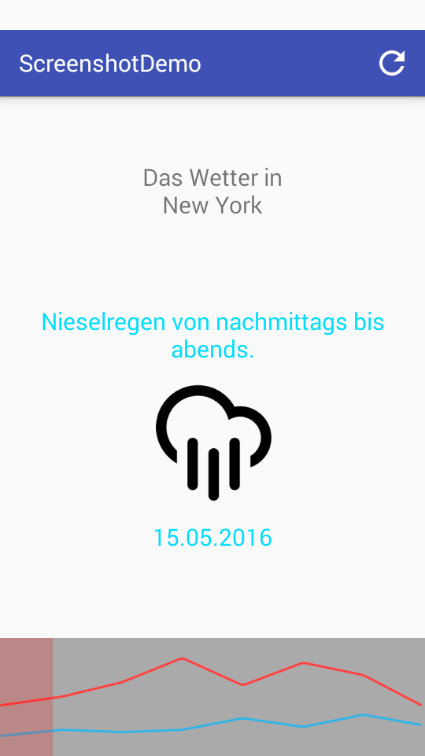

footer: © Edward Dale, 2016
slidenumbers: true
theme: Next

# Screenshot
## your Entire App
### Edward Dale
### Freeletics

---

# Find the bug(s)


---


---


---

# [fit] Some things
# [fit] are best
# [fit] verified visually
# [fit] :point_down:
# [fit] Screenshot

---

# Screenshots are useful for

* Acceptance testing
  * Edge case
  * Localization
  * Multiple devices
* Regression testing

---


# Demo App[^1]

* Fetch location of user
* Fetch weather forecast at that location
* Show it in a nice way

[^1]: https://github.com/scompt/ScreenshotDemo

---


# Screenshot cases

* **How does it look when loading?**

---


# Screenshot cases

* How does it look when loading?
* **How does the error screen look?**

---


# Screenshot cases

* How does it look when loading?
* How does the error screen look?
* **How do all weather icons look?**

---



# Screenshot cases

* How does it look when loading?
* How does the error screen look?
* How do all weather icons look?
* **How does it look in German?**

---


# Screenshot testing tools

* Espresso tests
* Dependency injection
* Dependency mocking
* Screengrab

---

# Loading screen Espresso test


```java

@Rule
public ActivityTestRule<MainActivity> mActivityRule 
= new ActivityTestRule<>(MainActivity.class);

@Test
public void testProgressIsShownWhileLoading()
    throws Exception {
  
  // The activity is already started here
  
  // More about Screengrab later!
  Screengrab.screenshot("progress");
  
  // No assertions
}

```

---

# Loading screen test problems


* What if the app is really fast?
* What if the network is disconnected?

---

# Loading screen test problems


* What if the app is really fast?
* What if the network is disconnected?

## Answers

* Dependency injection
* Mocked dependencies

---

# Without dependency injection

```java
public class MainActivity extends AppCompatActivity {
  WeatherService weatherService = new ForecastIoWeatherService();
  ...
}
```

* `MainActivity` will **always** use forecast.io to load weather.

---

# With dependency injection

```java
public class MainActivity extends AppCompatActivity {
  @Inject
  WeatherService weatherService;
  ...
}
```

* `MainActivity` doesn't care which `WeatherService` it uses
* Can be different for production and tests

---

# Dagger dependency injection

```java
@Singleton
@Component(modules = {ForecastIoModule.class, ... })
public interface ScreenshotDemoComponent {
    void inject(MainActivity target);
}

@Module
@Singleton
public class ForecastIoModule {
    @Provides
    WeatherService provideWeatherService(ForecastIoWeatherService impl) {
        return impl;
    }
}
```

---

# Dagger dependency injection

```java
public class MainActivity extends AppCompatActivity {

  @Inject
  WeatherService weatherService;

  @Override
  protected void onCreate(Bundle savedInstanceState) {
    super.onCreate(savedInstanceState);
    // Fancy Dagger code to do injection
    ScreenshotDemoApplication.get(this).component().inject(this);
  }
    
  ...
}
```

---

# Loading screen test pseudocode


* Configure app to use `WeatherService` that loads forever
* Start activity
* Take screenshot

---

# Mock `WeatherService` with Mockito

```java
  WeatherService mockWeatherService 
    = mock(WeatherService.class);
  Single<LocationWeather> neverending 
    = Observable.<LocationWeather>never().toSingle();
        
  doReturn(neverending)
    .when(mockWeatherService)
    .weatherForLocation(Matchers.any(Location.class));   
```

---

# Loading screen mocked test 1


```java

@Rule
public ActivityTestRule<MainActivity> mActivityRule 
= new ActivityTestRule<>(MainActivity.class, false, false);

@Inject
WeatherService mockWeatherService;

@Before
public void injectTest() {
    // Inject test dependencies
    ...
}
```

---

# Loading screen mocked test 2

```java

@Test
public void testProgressIsShownWhileLoading()
    throws Exception {
  // Configure app
  doReturn(Observable.<LocationWeather>never().toSingle())
    .when(mockWeatherService)
    .weatherForLocation(Matchers.any(Location.class));
    
  // Start Activity
  mActivityRule.launchActivity(null /* Intent */);
  
  // Take screenshot
  Screengrab.screenshot("progress");
}

```

---


# Screenshot cases

* How does it look when loading?

---


# Screenshot cases

* ~~How does it look when loading?~~
* **How does the error screen look?**

---

# Error screen test

```java

@Test
public void testErrorShown()
    throws Exception {
  // Configure app
  doReturn(Observable.error(new Exception("message")).toSingle())
    .when(mockWeatherService)
    .weatherForLocation(Matchers.any(Location.class));
    
  // Start Activity
  mActivityRule.launchActivity(null /* Intent */);
  
  // Take screenshot
  Screengrab.screenshot("error");
}

```

---


# Error screen test

```java
@Test
public void testErrorShown()
    throws Exception {
  // Configure app
  doReturn(Observable.error(new Exception("message")).toSingle())
    .when(mockWeatherService)
    .weatherForLocation(Matchers.any(Location.class));
    
  // Start Activity
  mActivityRule.launchActivity(null /* Intent */);
  
  // Take screenshot
  Screengrab.screenshot("progress");
}

```

---


# Screenshot cases

* ~~How does it look when loading?~~
* **How does the error screen look?**

---


# Screenshot cases

* ~~How does it look when loading?~~
* ~~How does the error screen look?~~
* **How do all weather icons look?**

---

# All weather test pseudocode


* Configure app to use `WeatherService` that has every type of weather
* Start activity
* Take screenshot
* Swipe
* Repeat

---

# All weather test

```java
@Test
public void testErrorShown()
    throws Exception {
  // Configure app
  doReturn(Single.just(parseWeather("all_icons.json")))
    .when(weatherService)
    .weatherForLocation(Matchers.any(Location.class));
    
....
```

---

```java
  // Start Activity
  mActivityRule.launchActivity(null /* Intent */);
  
  // Take screenshots
  for (int i = 0; i < ICON_COUNT; i++) {
    Screengrab.screenshot("icon_" + i);
    onView(withId(R.id.view_pager)).perform(swipeLeft());
  }
  
  // Still no assertions
}

```

---


# Screenshot cases

* ~~How does it look when loading?~~
* ~~How does the error screen look?~~
* **How do all weather icons look?**

---


# Screenshot cases

* ~~How does it look when loading?~~
* ~~How does the error screen look?~~
* ~~How do all weather icons look?~~
* **How does it look in German?**

---


Automated localized screenshots of your Android app on every device

Screengrab :arrow_forward: Fastlane :arrow_forward: Fabric :arrow_forward: Twitter

Combination of command-line tool and classes used in tests

---

* Add `LocaleTestRule` to test classes
* Enables locale switching

```java
@RunWith(AndroidJUnit4.class)
@LargeTest
public class TestMainActivity {

  @ClassRule
  public static final LocaleTestRule localeTestRule 
    = new LocaleTestRule();
  ...
```

---

* Install screengrab
* Run `screengrab init` to generate configuration file
* Adjust configuration

---

```ruby
app_package_name 'com.scompt.screenshotdemo'
use_tests_in_packages ['com.scompt.screenshotdemo']
app_apk_path 'app-debug.apk'
tests_apk_path 'app-debug-androidTest-unaligned.apk'
locales ['en-US', 'de-DE', 'fr-FR']
ending_locale 'en-US'
```

---

# Run tests

```bash
$ ./gradlew clean assembleDebug assembleDebugTest
$ screengrab
```

---


---


---

# Issues

* Naming and organization of files
* Misusing screengrab a bit

---


# Alternative/related solutions

* [Spoon](https://github.com/square/spoon)
  * Distributes instrumentation tests to all devices
  * Spoon + Screengrab = Amazing?
* [Firebase Test Lab for Android](https://firebase.google.com/docs/test-lab/)
  * Cloud solution that run by Google
  * Can also run on different locales

---


# Thanks!
## Edward Dale (@scompt)
## Freeletics (We're hiring)

